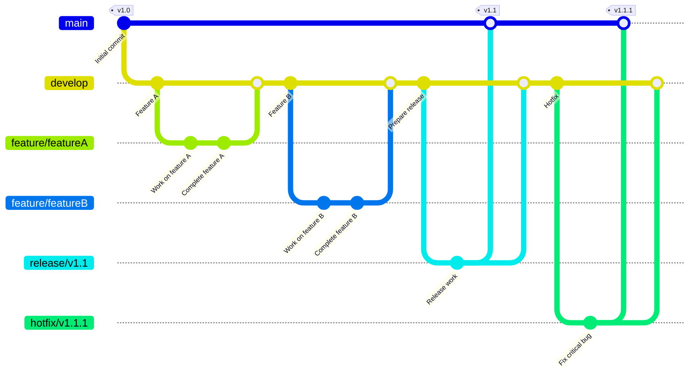

  

## about

VR界隈の情報共有serviceの構築する。  
イベントやコミュニティの情報を一元的にまとめたい。  
まずは日々開催されているイベントの情報をより見やすくユーザーに届ける。  
結局は車輪の再発明だが。。

ユーザーがイベントを掲載できて
演者の募集や打診によるオーガナイザーのマッチング

## 目標

- イベント作成機能
  - 一覧表示
  - 詳細表示
  - 共有(外部SNS)
  - 検索
  - 編集
  - 削除
  - イベント情報の出演者の管理
  - 予約公開
  - タイムライン表示
  - custom id

- bookmark
- いいね
- タグ
- カテゴリ

- チーム機能
  - チーム作成
  - チーム編集
  - チーム削除
  - チームメンバーの管理
  - ロールの管理

- 出演者の募集
- 登録Userへのイベント出演依頼
- イベント管理機能

- qiitaやzennのような記事投稿機能

## 技術スタック

- [laravel](https://laravel.com/)
  - [sail](https://laravel.com/docs/10.x/sail) (爆速環境構築まん)
  - [jetstream](https://jetstream.laravel.com) (認証含めた神パッケージ)
  - [inertia](https://inertiajs.com/forms) (バックとフロントの密結合)
  - [scout](https://laravel.com/docs/10.x/scout) (全文検索)
  - [socialite](https://laravel.com/docs/10.x/socialite) (SNSログイン)
  - [cashier](https://laravel.com/docs/10.x/billing) (決済 その内いれたい。)
- [vue.js](https://vuejs.org/)
- [tailwindcss](https://tailwindcss.com/)
  - [daisyui](https://daisyui.com/)

- [tiptap](https://tiptap.dev) (WYSIWYGエディター)
- [meilisearch](https://www.meilisearch.com/) (全文検索)
  - 日本語の検索がいまいちなためimageはprototypeを使用
- [swiper](https://swiperjs.com/) (カルーセルバナー)
- [date-fns](https://date-fns.org/) (日付操作)  day.jsは削除予定
- [iconify](https://iconify.design/) (Iconに使用)

## 開発環境構築

1. git cloneして
2. .env.exampleをコピーして.envを作成
3. .envのDBの設定
   GOOGLEとDISCORDの<ここ必要>の個所を埋める。
   それぞれ個人で取得して設定してください  
   SNSログインができなくなるだけなので必要なければ設定不要。  

   ※MEILISEARCH　に関しては後ほどdocker imageをビルドしてから行う。

4. 依存ファイルのインストール
   1. `docker-compose up -d`
      ここで初回のインストールなりビルドが走ると思う。(多分)
   2. `docker-compose exec laravel.test bash`
   3. `npm i`
   4. `composer install`
   5. `exit`
   ここの手順あいまい。
   composerをPC自体にインストールして
   composer installしてたかも
5. `./vendor/bin/sail up`
   おこのみでsailのショートカットを作成してください
   `alias sail='[ -f sail ] && sh sail || sh vendor/bin/sail'`
6. メイリサーチセットアップ[notion参照](https://www.notion.so/ff35198dd447429ebaf3058b88d71034)
7. `docker-compose exec laravel.test bash`
8. `npm run dev`
    この段階ではログイン画面は表示されないと思う
9.  `php artisan migrate`
10. `php artisan db:seed`

## 構築後の起動

1. `sail up -d` sail環境の起動
2. `docker exec -it sphere_app-laravel.test-1  bash` で立ち上げた環境に入る。
3. `npm run dev` 開発サーバ起動

## gitの運用ワークフロー

- git-flow
- 初期リリースまではmainブランチからfeatureを切って作業

